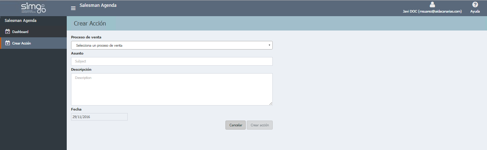

       
  
---    
  
## Crear acción   
  
**Crear acción** nos permite vincular acciones a nuestras ofertas desde el _Menú de opciones_, el _Panel de control_ y el _Seguimiento de oferta_.  
  
    
  

 Así añadiremos imágenes a la documentación. Para ello deben estar también en C:\Papyrus\Images.  

 Una vez dentro de la creación, _completaremos el formulario correspondiente_.  
  

 Según la fecha de la acción, ésta aparecerá como acción _Pendiente_ o para _hoy_.  
